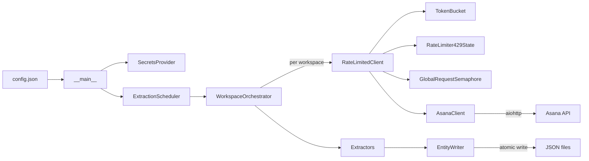
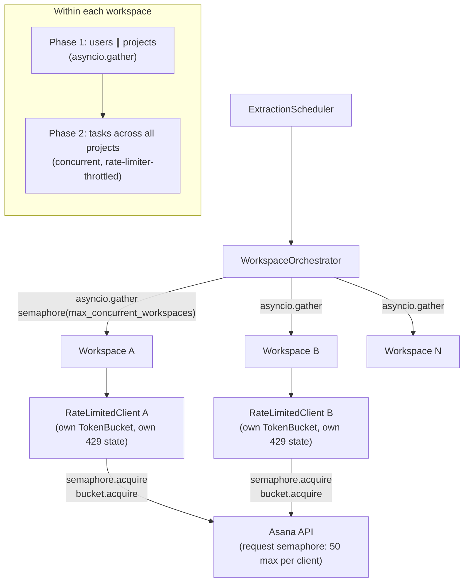

# Asana Extractor

Async, rate-limited data extractor for the Asana API with per-workspace isolation.

## Overview

Asana Extractor retrieves **users**, **projects**, and **tasks** from the Asana API and writes each entity to an individual JSON file. It runs as a long-lived service with periodic extraction cycles, or as a one-shot command via `--run-once`.

Key capabilities:

- **Async I/O** — built on Python 3.12+ asyncio and aiohttp for concurrent HTTP requests
- **3-tier rate limiting** — token bucket pacing, 429 pause-and-retry handling, and request semaphore backpressure
- **Workspace isolation** — each workspace gets independent rate limiting; one workspace's failure never affects others
- **Periodic scheduling** — configurable 30-second or 5-minute extraction intervals with skip-on-overlap protection
- **Atomic writes** — temp-file-then-`os.replace` ensures no partial JSON files on disk

## Setup

1. **Clone the repository:**

   ```bash
   git clone https://github.com/your-org/asana-extractor.git
   cd asana-extractor
   ```

2. **Create a virtual environment and install:**

   ```bash
   uv venv && uv pip install -e ".[dev]"
   ```

3. **Configure:**

   ```bash
   cp config.json.example config.json
   ```

   Edit `config.json` — set `extraction_interval` (30 or 300) and add your workspace(s) to the `tenants` array with their GIDs and PATs.

   Create a `.env` file with your Personal Access Token:

   ```
   ASANA_PAT=1/your-personal-access-token
   ```

4. **Run:**

   ```bash
   # Single extraction cycle
   asana-extractor --run-once

   # Periodic extraction (runs until SIGTERM/SIGINT)
   asana-extractor
   ```

   Alternative entry point: `python -m asana_extractor`

## Configuration

All settings are loaded from `config.json` at startup. See `config.json.example` for a complete template.

| Field | Type | Default | Description |
|---|---|---|---|
| `extraction_interval` | `30 \| 300` | *(required)* | Extraction cycle interval in seconds |
| `output_dir` | `string` | `"output"` | Base directory for JSON output files |
| `log_level` | `"DEBUG" \| "INFO" \| "WARNING" \| "ERROR"` | `"INFO"` | Structured log verbosity |
| `max_concurrent_workspaces` | `integer (>= 1)` | `10` | Maximum workspaces processed concurrently |
| `shutdown_timeout_seconds` | `integer (>= 1)` | `300` | Grace period for in-flight requests on shutdown |
| `tenants` | `array` | *(required)* | Workspace configs — each entry has `workspace_gid` and `pat` |

## Architecture



**Components:**

- **AsanaClient** (`client.py`) — Async HTTP client wrapping aiohttp with PAT-based authentication, connection pooling (100 connections), and automatic retry on transient errors using tenacity (3 attempts, exponential backoff + jitter). Classifies errors into `AsanaTransientError` (5xx, connection failures) and `AsanaPermanentError` (4xx). Provides `paginated_get()` that follows `next_page.offset` until exhausted.

- **RateLimitedClient** (`rate_limited_client.py`) — Drop-in wrapper around AsanaClient that composes three rate limiting primitives: per-workspace token bucket (~120 req/min), 429 pause coordination, and per-instance request semaphore (50 concurrent). Every single-entity `get()` flows through: `wait_if_paused` → `semaphore.acquire` → `bucket.acquire` → HTTP call → handle 429 if needed. Note: `paginated_get()` currently acquires the semaphore and token bucket once per call rather than per page — a known limitation documented below.

- **TokenBucket + WorkspaceRateLimiterRegistry** (`rate_limiter.py`) — Async token bucket with continuous refill at 2 tokens/sec (burst cap 10). The registry auto-creates one bucket per workspace on first request, ensuring per-workspace isolation. Also provides `RateLimiter429State` for 429 pause coordination and `GlobalRequestSemaphore` for backpressure.

- **Extractors** (`extractors.py`) — Stateless per-entity-type classes (`UserExtractor`, `ProjectExtractor`, `TaskExtractor`) inheriting `BaseExtractor` ABC. Dependencies (client, writer) are injected at `extract()` call time. Each extractor defines its API endpoint and query params; the base class handles pagination, writing, and metrics. `TaskExtractor.extract_all()` runs concurrent extraction across all projects.

- **EntityWriter** (`writer.py`) — Atomic JSON writer using orjson serialization. Writes to a temp file then `os.replace()` for crash safety. Output path: `{output_dir}/{workspace_gid}/{entity_type}/{entity_gid}.json`.

- **WorkspaceOrchestrator** (`orchestrator.py`) — Runs extraction across all tenant workspaces concurrently via `asyncio.gather`. Each workspace gets its own `RateLimitedClient` instance (with independent token bucket, 429 state, and request semaphore). A semaphore caps concurrent workspace tasks at `max_concurrent_workspaces`. Each workspace runs inside `try/except` so one failure never aborts others. The `run()` method never raises.

- **ExtractionScheduler** (`scheduler.py`) — Drives periodic extraction at fixed intervals. Implements skip-on-overlap: if a cycle exceeds the interval, the next cycle is skipped with a warning log. Handles SIGTERM/SIGINT for graceful shutdown — waits up to `shutdown_timeout_seconds` for in-flight work to complete before cancelling.

## Concurrency Model



**Isolation guarantees:**

- Each workspace gets its own `RateLimitedClient` with independent token bucket and 429 state — Workspace A hitting its rate limit does not slow down Workspace B.
- Workspace extraction runs inside `try/except` — one workspace failing with an API error does not cancel or abort other workspaces.
- Each `RateLimitedClient` has an `asyncio.Semaphore(50)` capping its in-flight HTTP requests. Note: the semaphore is per-client (i.e. per-workspace), not shared globally — with many concurrent workspaces, total in-flight requests can exceed 50. See Known Limitations below.
- Within each workspace, users and projects are extracted concurrently (Phase 1), then tasks are extracted concurrently across all discovered projects (Phase 2).

## Rate Limit Handling

Asana enforces approximately **150 requests per minute per workspace/token**. The extractor uses a 3-tier strategy:

### 1. Proactive Pacing (Token Bucket)

Each workspace gets a `TokenBucket` refilling at 2 tokens/sec (~120 req/min, conservative margin below the 150 limit). `acquire()` blocks callers via `asyncio.sleep` until a token is available — transparent to the caller. The `WorkspaceRateLimiterRegistry` auto-creates and caches a bucket per workspace on first request.

### 2. Reactive Handling (429 Response)

When the API returns `429 Too Many Requests`:

1. The `RateLimiter429State` **pauses all requests** for that workspace for 60 seconds. (The `Retry-After` header is not currently parsed — a fixed 60-second pause is always used. See Known Limitations.)
2. After the pause, **resets the token bucket to 0** to prevent a burst of queued requests firing simultaneously.
3. The failed request is retried once after the pause.
4. After **3 consecutive 429s** without a successful request in between, the workspace is **failed for this cycle** (`AsanaTransientError` raised) — preventing an infinite retry loop.

### 3. Backpressure (Request Semaphore)

An `asyncio.Semaphore(50)` in each `RateLimitedClient` caps the number of concurrent in-flight HTTP requests for that workspace. This prevents any single workspace from overwhelming the API. Note: the semaphore is per-workspace (per-client instance), not shared globally across all workspaces.

**How the tiers compose:** Every request passes through `wait_if_paused()` → `semaphore.acquire()` → `bucket.acquire()` → HTTP call → 429 handling if needed.

## Scalability

| Challenge | Mechanism |
|---|---|
| **Thousands of workspaces** | Concurrent extraction via `asyncio.gather`, capped by `max_concurrent_workspaces` semaphore (default 10). Each workspace gets an isolated rate limiter — no cross-workspace blocking. |
| **Thousands of entities per workspace** | Streaming writes — entities are written to disk as they arrive from pagination, not buffered in memory. `paginated_get()` follows `next_page.offset` automatically. |
| **API rate limits at scale** | Per-workspace token buckets (~120 req/min each) prevent any single workspace from starving others. Per-workspace request semaphore (50 in-flight) provides backpressure within each workspace. |
| **Partial failures** | Workspace isolation: each workspace runs inside `try/except` with `asyncio.gather`. One workspace's API error is captured in `OrchestratorResult.failed` without aborting others. Transient errors are retried with exponential backoff + jitter. |
| **Long-running extractions** | Skip-on-overlap scheduling: if a cycle exceeds the interval, the next cycle is skipped with a warning log — no queue buildup or unbounded memory growth. |

**Future scaling considerations:** At 10,000+ workspaces, the single-process asyncio model would benefit from distributed workers (process pool or separate nodes), a persistent job queue for extraction tasks, incremental/delta extraction (only fetch changed entities), and database output instead of filesystem writes.

## Known Limitations

Three implementation gaps exist in the current rate limiting layer. They don't affect correctness for small-to-moderate workloads but would matter at scale:

1. **Retry-After header not parsed** — When the API returns a `429`, the `Retry-After` response header is not extracted. The system always pauses for a fixed 60 seconds. The plumbing exists in `RateLimiter429State.record_429(retry_after=...)` but the HTTP layer always passes `None`. Fix: extract the header in the 429 handler in `rate_limited_client.py` and pass it through.

2. **`paginated_get()` acquires rate limits once per call, not per page** — The `RateLimitedClient.paginated_get()` method acquires the semaphore and token bucket once for the entire pagination stream. Subsequent pages (potentially dozens for large entity sets) bypass both the token bucket and semaphore. Fix: restructure to acquire per-page, either by wrapping each page's HTTP call or by moving rate limiting into the pagination loop.

3. **Request semaphore is per-workspace, not global** — Each `RateLimitedClient` instance creates its own `GlobalRequestSemaphore`. Since the orchestrator creates one client per workspace, 10 concurrent workspaces could have up to 500 in-flight requests (10 x 50), not 50 total. Fix: create a single semaphore in the orchestrator and inject it into all clients.

## Testing

```bash
# Run tests (asyncio_mode=auto, no manual event loop setup needed)
pytest

# Type checking (strict mode)
mypy --strict src/

# Linting
ruff check src/ tests/
```

Testing patterns used:

- **aioresponses** for mocking HTTP responses in async client tests
- **Fake client pattern** for extraction tests — plain async generators replace `paginated_get()` without `AsyncMock` limitations
- Tests cover: API interaction (auth, pagination, error classification), output correctness (atomic writes, file paths), rate limiting (token bucket, 429 handling), and scheduler lifecycle

## Project Structure

```
src/asana_extractor/
├── __init__.py            # Package exports
├── __main__.py            # CLI entry point (config → logging → secrets → orchestrator → scheduler)
├── client.py              # Async HTTP client (auth, pagination, retry with tenacity)
├── config.py              # Configuration model (pydantic BaseModel) and loader
├── exceptions.py          # Exception hierarchy (AsanaTransientError / AsanaPermanentError)
├── extractors.py          # Entity extractors (users, projects, tasks) and workspace orchestration
├── logging.py             # Structured logging setup (structlog, JSON output)
├── orchestrator.py        # Multi-workspace concurrent processor with isolation
├── rate_limited_client.py # Rate-limited wrapper composing all throttling primitives
├── rate_limiter.py        # Token bucket, 429 state, workspace registry, global semaphore
├── scheduler.py           # Periodic execution (skip-on-overlap, graceful shutdown)
├── secrets.py             # Secrets interface (ABC + .env provider via python-dotenv)
├── tenant.py              # Tenant/workspace configuration types and provider
└── writer.py              # Atomic JSON file writer (tmp + os.replace, orjson)
```
